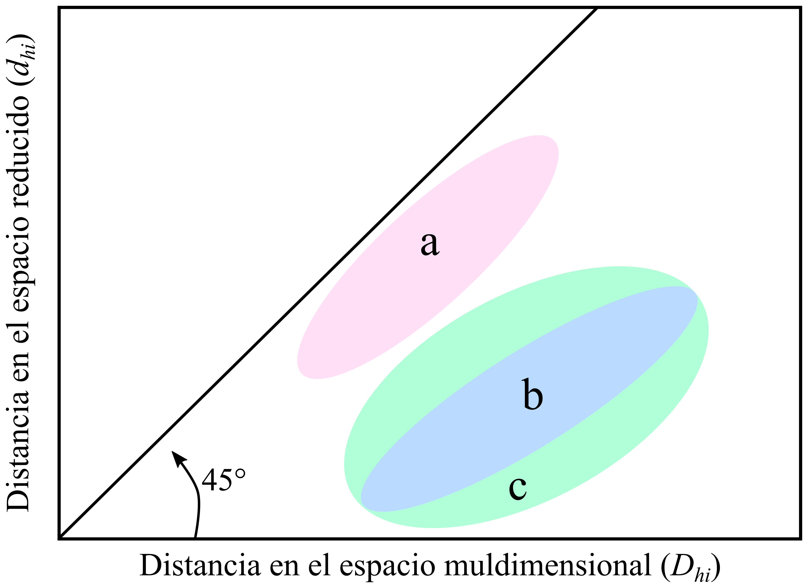

```{r setup, include=FALSE}

library(vegan)
library(tidyverse)
library(patchwork)

#  Principal coordinates analysis of Bray Curtis distances of dune data
data(dune)
d <- vegdist(t(dune))
ord <- wcmdscale(d, eig = TRUE)

pcoa_p <- ord$points |> 
  as_tibble(rownames = "spp") |> 
  ggplot(aes(Dim1, Dim2)) +
  geom_vline(xintercept = 0, color = "grey") +
  geom_hline(yintercept = 0, color = "grey") +
  geom_text(aes(label = spp), size = 3.5) +
   labs(tag = "A") +
  theme_minimal()


#  Shepard plot
p <- stressplot(ord)   

shepard_p <- left_join(enframe(d), enframe(p), by = "name") |> 
  ggplot(aes(value.x, value.y)) +
  geom_point() +
  geom_abline(intercept = 0, slope = 1, color = 'dodgerblue') +
  labs(x = "Distancias reales", y = "Distancias en el PCoA", tag = "B") +
   xlim(0, 1) +
   ylim(0, 1) +
  theme_linedraw(base_size = 12) +
  theme(panel.grid = element_blank())


```

<!--Resumen-->

El análisis de coordenadas principales es un método para explorar y visualizar similitudes o diferencias en los datos.

# ¿Qué es un Análisis de Coordenadas Principales?

```{=html}
<!--
`r sprintf("<span style='color: %s;'>%s</span>", "#989898", "Version en RMarkdown y código en xXx")`
-->
```
El Análisis de Coordenadas Principales (PCoA) también se conoce como Escalado Multidimensional (MDS) o escalado clásico. (Fíjate en la diferencia entre este MDS y su pariente más popular, el nmMDS, Escalado Multidimensional no métrico).

El PCoA es similar a un PCA, en vez de analizar una tabla de datos, el PCoA analiza una matriz de distancia o disimilitud. El objetivo del PCoA representar estas distancias en un espacio euclidiano de pocas dimensiones (usualmente de 2 o 3 ejes) con la menor pérdida de información posible. Esto permite que su interpretación sea simple: los objetos (o puntos) más cercanos entre sí son más similares que los objetos que se encuentran más separados. El PCoA se puede usar para analizar variables u observaciones.

A diferencia del Análisis de Componentes Principales (PCA) que se basa en correlaciones y varianza, el PCoA puede usar cualquier medida de distancia. Esto le da mucha flexibilidad, ya que se pueden analizar datos descritos por variables cuantitativas, semi-cuantitativas, categóricas y binarias. Además, esta flexibilidad lo convierte en una herramienta útil para analizar datos con excesos de ceros como los que se generan en estudios ecológicos con especies raras.

<!-- Diferencias entre PCoA y PCA -->

<!-- Diferencias entre PCoA y nmMDS -->

<!-- Diferencias entre PCoA y analisis de agrupamiento -->

<!-- recuros https://towardsdatascience.com/principal-coordinates-analysis-cc9a572ce6c#:~:text=What%20is%20Principal%20Coordinates%20Analysis,other%2C%20and%20which%20are%20different.-->

# ¿Cómo evaluar la calidad de un PCoA?

Para evaluar que tan bien el PCoA se aproxima a las distancias originales, las distancias se pueden graficar entre sí (las del PCoA vs las originales) en un gráfico llamado **diagrama de Shepard** (Fig. \@ref(fig:shepard)).

Un diagrama de Shepard es un diagrama de dispersión que compara distancias en un espacio de dimensión reducida, obtenido por métodos de ordenación como el PCoA, con distancias en la matriz de asociación original. Este puede usarse para estimar la representatividad de ordenaciones obtenidas usando cualquier método de ordenación de espacio reducido. En el análisis de coordenadas principales y el escalado multidimensional no métrico, las distancias euclidianas entre los objetos en el espacio reducido se comparan con las distancias $D_{hi}$ encontradas en la matriz utilizada como base para calcular la ordenación (tus datos iniciales).

```{r shepard, echo=FALSE, message=FALSE, warning=FALSE, fig.cap="Diagrama de Shepard. Tres situaciones encontradas al comparar distancias entre objetos, en el espacio p-dimensional de los descriptores originales p (abscisas) vs el espacio reducido d-dimensional (ordenadas). La figura solo muestra los contornos de las dispersiones de puntos. (a) La proyección en un espacio reducido representa una gran fracción de la varianza; se puede interpretar también como que las posiciones relativas de los objetos en el espacio reducido d-dimensional son similares a las del espacio p-dimensional. (b) La proyección representa una pequeña fracción de la varianza, pero las posiciones relativas de los objetos son similares en los dos espacios. (c) Igual que (b), pero las posiciones relativas de los objetos difieren en los dos espacios. Modificado de Legendre y Legendre (2012)."}


```

# Un ejemplo de PCoA

En la Figura \@ref(fig:pcoa) se muestran los resultados de un Análisis de Coordenadas Principales aplicados a datos de vegetación de dunas (*dune* del paquete vegan en R). Los datos describen las coberturas de 30 especies de plantas en 20 sitios. Los nombres de las especies fueron abreviados en 4+4 letras (e.g. *Salix repens* = Salirepe).

```{r pcoa, echo=FALSE, message=FALSE, warning=FALSE, fig.cap="**A**: Resultados obtenidos de un PCoA aplicado a datos de vegetación de dunas. Los dos primeros ejes representan el 45 % de las variaciones en la matriz de distancia. **B**: Diagrama de Shepard. La línea principal representa las distancias de Bray-Curtis originales entre las especies y el eje vertical contiene las distancias de la proyección bidimensional (dos ejes) del PCoA. Siguiendo la explicación en la Fig. 1, sobre el diagrama de Shepard, el PCoA de este ejemplo representa una pequeña fracción de la varianza y las posiciones relativas de los objetos difieren en los dos espacios (o matrices de distancia)."}

pcoa_p + shepard_p

```

# Referencias

Legendre P, Legendre L (2012) Numerical ecology. Elsevier, Amsterdam
